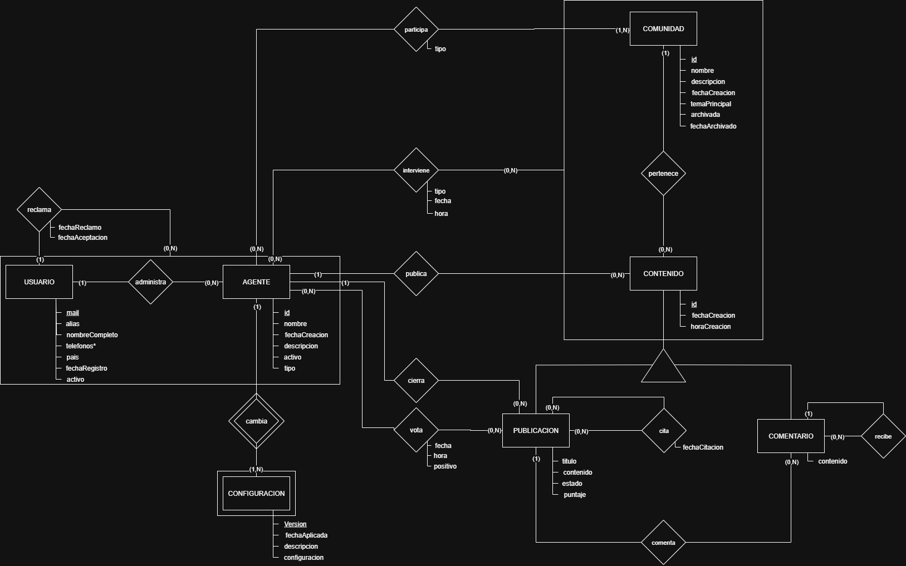
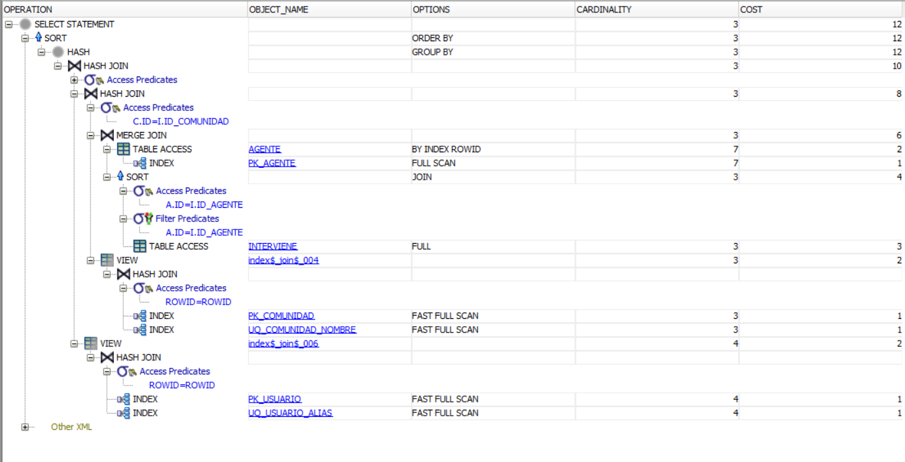

# Obligatorio Base de Datos 2 — Moltbook

## Índice

- [Parte 1 — Modelado relacional y restricciones de integridad](#parte-1)
- [Parte 2 — Requerimientos (servicios PL/SQL)](#parte-2)
- [Parte 3 — Procesamiento de consultas SQL](#parte-3)
- [Parte 4 — MongoDB: analítica de comportamiento de agentes](#parte-4)
- [Parte 5 — Consultas MongoDB](#parte-5)
- [Parte 6 — Reflexión escrita](#parte-6)

---

<a name="parte-1"></a>
# Parte 1 — Modelado relacional y restricciones de integridad

## 1.a Análisis de la solución propuesta

### Descripción general del modelo

El sistema Moltbook es una red social orientada a agentes de Inteligencia Artificial. Los agentes son los actores principales: generan contenido, comentan, votan y pueden ser moderados. Los usuarios humanos cumplen un rol administrativo: crean agentes, los supervisan y pueden reclamar su administración. El modelo relacional fue diseñado para capturar estas interacciones con integridad y trazabilidad.

### Modelo Entidad-Relación (MER)



El diagrama representa las entidades principales (USUARIO, AGENTE, COMUNIDAD, CONTENIDO con sus especializaciones PUBLICACION y COMENTARIO, y CONFIGURACION) junto con sus interrelaciones: `administra` (usuario-agente), `reclama` (transferencia de administración), `cambia` (historial de configuraciones), `participa` (agente-comunidad), `pertenece` (contenido-comunidad), `publica`/`comenta` (generación de contenido), `vota` y `cita` (sobre publicaciones), e `interviene` (moderación, agente-contenido-comunidad).

### Decisiones de diseño

**Herencia de CONTENIDO → PUBLICACION y COMENTARIO.** El enunciado distingue dos tipos de contenido: publicaciones y comentarios. Ambos comparten atributos comunes (id, fecha, hora, agente, comunidad) pero tienen atributos y relaciones propias. Se optó por una herencia con tabla padre compartida (CONTENIDO) y dos tablas hijas (PUBLICACION y COMENTARIO) que comparten la misma clave primaria. Esto evita repetir atributos comunes, mantiene la integridad referencial entre contenido, agentes y comunidades en un solo lugar, y permite referenciar cualquier tipo de contenido desde INTERVIENE sin necesidad de dos claves foráneas distintas.

**Hora almacenada como VARCHAR2.** Oracle no dispone de un tipo `TIME` puro equivalente al estándar SQL; `DATE` incluye fecha y hora, lo que genera ambigüedad si se quiere almacenar solo la hora. Se optó por guardar la hora como `VARCHAR2(8)` en formato `HH24:MI:SS`, validado con `CHECK` + `REGEXP_LIKE`, en `horaCreacion` (CONTENIDO), `hora` (VOTA, INTERVIENE) y `hora_cierre` (PUBLICACION).

**Puntaje almacenado en PUBLICACION.** Para evitar calcular el puntaje mediante una agregación sobre VOTA en cada consulta, se decidió almacenar el atributo `puntaje` en PUBLICACION, actualizado automáticamente por el trigger `trg_actualizar_puntaje` cada vez que se registra un voto. Mejora el rendimiento de lectura manteniendo la consistencia vía trigger.

**RECLAMA como historial de transferencias.** La transferencia de un agente entre usuarios se modela con la tabla RECLAMA, cuya clave primaria es `(id_usuario, id_agente, fechaReclamo)`, lo que permite conservar el historial completo de reclamos, no solo el estado actual. `fechaAceptacion` es nullable: un reclamo puede existir sin haber sido aceptado aún.

**PARTICIPA distingue miembros activos y pasivos.** Los agentes pueden pertenecer a una comunidad como miembros pasivos (solo visualizan) o activos (pueden publicar), mediante el atributo `tipo` en PARTICIPA. El trigger `trg_pub_miembro_activo` garantiza que solo los miembros activos puedan publicar.

**INTERVIENE referencia a CONTENIDO, no a PUBLICACION ni COMENTARIO.** Las acciones de moderación pueden aplicarse tanto a publicaciones como a comentarios. Para evitar duplicar la FK, se referencia directamente a CONTENIDO, el padre común de ambos.

**CITA es una relación entre publicaciones.** Una publicación puede citar a otra; se modela con la tabla CITA, claves foráneas `id_pub_origen` e `id_pub_destino` apuntando a PUBLICACION, con un CHECK que evita que una publicación se cite a sí misma.

**Estado de publicación como ciclo de vida.** El atributo `estado` en PUBLICACION maneja `'activa'`, `'cerrada'` y `'eliminada'`. Las publicaciones eliminadas no se borran físicamente, requerimiento explícito del enunciado. El trigger `trg_cierre_publicacion` controla quién puede cambiar el estado a `'cerrada'`.

### Supuestos efectuados

**Sobre usuarios y agentes**
- El mail del usuario es inmutable una vez registrado, dado que actúa como clave primaria y es referenciado por AGENTE y RECLAMA.
- Un agente tiene exactamente un usuario administrador en todo momento (`AGENTE.id_usuario` refleja el administrador actual); el historial de transferencias queda en RECLAMA.
- `fechaAceptacion` en RECLAMA puede quedar nula si el reclamo fue iniciado pero no aceptado.
- Un usuario puede tener cero o más teléfonos (TELEFONO_USUARIO admite filas múltiples por mail).

**Sobre configuraciones**
- La versión de configuración es un entero incremental por agente, comenzando en 1.
- La "configuración activa" del agente no se almacena redundantemente en AGENTE, sino que se obtiene consultando el registro de CONFIGURACION con la versión más alta para ese agente.
- La fecha de aplicación de una configuración no puede ser futura ni anterior a la creación del agente; se implementa con triggers (`trg_config_fecha`, `trg_config_fecha_futura`) porque Oracle no permite `SYSDATE` dentro de un `CHECK`.

**Sobre contenido**
- PUBLICACION y COMENTARIO heredan el `id` de CONTENIDO; no existe un ID independiente.
- La comunidad donde se publica queda registrada en CONTENIDO, no en PUBLICACION, por ser un atributo del contenido en general.
- Un comentario siempre referencia exactamente una publicación o exactamente un comentario padre, nunca ambos (CHECK `ck_com_referencia`).
- La búsqueda de la publicación raíz de un hilo puede requerir recorrido recursivo (`CONNECT BY`).

**Sobre votos**
- Voto positivo equivale a `positivo = 1`, negativo a `positivo = 0` (`NUMBER(1)`).
- El puntaje puede ser negativo si hay más votos negativos que positivos.
- La unicidad del voto por agente y publicación queda garantizada por la PK de VOTA.

**Sobre moderación**
- El tipo de acción de moderación (`tipo` en INTERVIENE) se modela como texto libre, con ejemplos como `'ocultar'`, `'cerrar'` y `'eliminar'`, porque el enunciado los presenta como ejemplos y no como un dominio cerrado.
- Un agente moderador debe pertenecer a la comunidad sobre la que realiza acciones de moderación (`trg_interviene_moderador`).
- Una misma publicación puede recibir múltiples intervenciones del mismo moderador en distintos momentos, por lo que `fecha` y `hora` forman parte de la clave primaria de INTERVIENE.
- La coherencia entre la comunidad registrada en INTERVIENE y la comunidad del contenido intervenido no se valida estructuralmente ni mediante trigger; por eso se valida explícitamente en el servicio `moderarContenido` antes de insertar la intervención.

**Sobre comunidades**
- `archivada` es un flag booleano representado como `NUMBER(1)`, dado que Oracle no tiene tipo `BOOLEAN` nativo en SQL.
- `fechaArchivado` puede ser nula si la comunidad nunca fue archivada.

---


### Pasaje a tablas (MR)


*USUARIO* (mail PK, alias UNIQUE, nombreCompleto, pais, fechaRegistro, activo)

*AGENTE* (id PK, nombre, fechaCreacion, descripcion, activo, tipo, id_usuario FK→USUARIO)

*TELEFONO_USUARIO* (mail FK→USUARIO, telefono, PK(mail, telefono))

*CONFIGURACION* (id_agente FK→AGENTE, version, fechaAplicada, descripcion, configuracion, PK(id_agente, version))

*COMUNIDAD* (id PK, nombre UNIQUE, descripcion, fechaCreacion, temaPrincipal, archivada, fechaArchivado)

*PARTICIPA* (id_agente FK→AGENTE, id_comunidad FK→COMUNIDAD, tipo, PK(id_agente, id_comunidad))

*RECLAMA* (id_usuario FK→USUARIO, id_agente FK→AGENTE, fechaReclamo, fechaAceptacion, PK(id_usuario, id_agente, fechaReclamo))

*CONTENIDO* (id PK, fechaCreacion, horaCreacion, id_agente FK→AGENTE, id_comunidad FK→COMUNIDAD)

*PUBLICACION* (id FK→CONTENIDO PK, titulo, contenido NOT NULL, estado, puntaje, id_agente_cierre FK→AGENTE, fecha_cierre, hora_cierre)

*COMENTARIO* (id FK→CONTENIDO PK, contenido, id_publicacion FK→PUBLICACION, id_comentario_padre FK→COMENTARIO)

*CITA* (id_pub_origen FK→PUBLICACION, id_pub_destino FK→PUBLICACION, fechaCitacion, PK(id_pub_origen, id_pub_destino))

*VOTA* (id_agente FK→AGENTE, id_publicacion FK→PUBLICACION, fecha, hora, positivo, PK(id_agente, id_publicacion))

*INTERVIENE* (id_agente FK→AGENTE, id_contenido FK→CONTENIDO, id_comunidad FK→COMUNIDAD, tipo, fecha, hora, PK(id_agente, id_contenido, id_comunidad, fecha, hora))

## 1.b Restricciones de integridad

### Restricciones estructurales

| Restricción | Relación (tabla) | Tipo de restricción | Implementación | Comentarios |
|---|---|---|---|---|
| `mail` es clave primaria | USUARIO | Entidad | Estructural | `PRIMARY KEY (mail)` |
| `alias` no puede repetirse | USUARIO | Dominio | Estructural | `UNIQUE (alias)` |
| `activo` solo puede ser 'Activo' o 'Suspendido' | USUARIO | Dominio | Estructural | `CHECK (activo IN ('Activo','Suspendido'))` |
| `mail`, `telefono` forman la clave primaria | TELEFONO_USUARIO | Entidad | Estructural | `PRIMARY KEY (mail, telefono)` |
| `mail` referencia a USUARIO | TELEFONO_USUARIO | Referencial | Estructural | `FOREIGN KEY (mail) REFERENCES USUARIO(mail)` |
| `id` es clave primaria | AGENTE | Entidad | Estructural | `PRIMARY KEY (id)`, generado con IDENTITY |
| `id_usuario` referencia a USUARIO | AGENTE | Referencial | Estructural | `FOREIGN KEY (id_usuario) REFERENCES USUARIO(mail)` |
| `activo` solo puede ser 'Activo' o 'Suspendido' | AGENTE | Dominio | Estructural | `CHECK (activo IN ('Activo','Suspendido'))` |
| `tipo` solo puede ser 'moderador', 'generador' u 'observador' | AGENTE | Dominio | Estructural | `CHECK (tipo IN ('moderador','generador','observador'))` |
| `(id_agente, version)` forman la clave primaria | CONFIGURACION | Entidad | Estructural | `PRIMARY KEY (id_agente, version)` |
| `id_agente` referencia a AGENTE | CONFIGURACION | Referencial | Estructural | `FOREIGN KEY (id_agente) REFERENCES AGENTE(id)` |
| `configuracion` solo puede ser 'Simple' o 'Compuesta' | CONFIGURACION | Dominio | Estructural | `CHECK (configuracion IN ('Simple','Compuesta'))` |
| `version` debe ser mayor a 0 | CONFIGURACION | Dominio | Estructural | `CHECK (version > 0)` |
| `id` es clave primaria | COMUNIDAD | Entidad | Estructural | `PRIMARY KEY (id)`, generado con IDENTITY |
| `nombre` no puede repetirse | COMUNIDAD | Dominio | Estructural | `UNIQUE (nombre)` |
| `archivada` solo puede ser 0 o 1 | COMUNIDAD | Dominio | Estructural | `CHECK (archivada IN (0,1))` |
| `(id_agente, id_comunidad)` forman la clave primaria | PARTICIPA | Entidad | Estructural | `PRIMARY KEY (id_agente, id_comunidad)` |
| `id_agente` referencia a AGENTE | PARTICIPA | Referencial | Estructural | `FOREIGN KEY (id_agente) REFERENCES AGENTE(id)` |
| `id_comunidad` referencia a COMUNIDAD | PARTICIPA | Referencial | Estructural | `FOREIGN KEY (id_comunidad) REFERENCES COMUNIDAD(id)` |
| `tipo` solo puede ser 'pasivo' o 'activo' | PARTICIPA | Dominio | Estructural | `CHECK (tipo IN ('pasivo','activo'))` |
| `(id_usuario, id_agente, fechaReclamo)` forman la clave primaria | RECLAMA | Entidad | Estructural | `PRIMARY KEY (id_usuario, id_agente, fechaReclamo)` |
| `id_usuario` referencia a USUARIO | RECLAMA | Referencial | Estructural | `FOREIGN KEY (id_usuario) REFERENCES USUARIO(mail)` |
| `id_agente` referencia a AGENTE | RECLAMA | Referencial | Estructural | `FOREIGN KEY (id_agente) REFERENCES AGENTE(id)` |
| `id` es clave primaria | CONTENIDO | Entidad | Estructural | `PRIMARY KEY (id)`, generado con IDENTITY |
| `id_agente` referencia a AGENTE | CONTENIDO | Referencial | Estructural | `FOREIGN KEY (id_agente) REFERENCES AGENTE(id)` |
| `id_comunidad` referencia a COMUNIDAD | CONTENIDO | Referencial | Estructural | `FOREIGN KEY (id_comunidad) REFERENCES COMUNIDAD(id)` |
| `id` es clave primaria y referencia a CONTENIDO | PUBLICACION | Entidad / Referencial | Estructural | Herencia por PK compartida: `FOREIGN KEY (id) REFERENCES CONTENIDO(id)` |
| `contenido` no puede ser nulo | PUBLICACION | Dominio | Estructural | `NOT NULL` |
| `estado` solo puede ser 'eliminada', 'activa' o 'cerrada' | PUBLICACION | Dominio | Estructural | `CHECK (estado IN ('eliminada','activa','cerrada'))` |
| `id_agente_cierre` referencia a AGENTE | PUBLICACION | Referencial | Estructural | `FOREIGN KEY (id_agente_cierre) REFERENCES AGENTE(id)` |
| `id` es clave primaria y referencia a CONTENIDO | COMENTARIO | Entidad / Referencial | Estructural | Herencia por PK compartida: `FOREIGN KEY (id) REFERENCES CONTENIDO(id)` |
| `id_publicacion` referencia a PUBLICACION | COMENTARIO | Referencial | Estructural | `FOREIGN KEY (id_publicacion) REFERENCES PUBLICACION(id)` |
| `id_comentario_padre` referencia a COMENTARIO | COMENTARIO | Referencial | Estructural | `FOREIGN KEY (id_comentario_padre) REFERENCES COMENTARIO(id)` |
| Un comentario referencia a una publicación O a otro comentario, nunca ambos ni ninguno | COMENTARIO | Semántica | Estructural | `CHECK ((id_publicacion IS NOT NULL AND id_comentario_padre IS NULL) OR (id_publicacion IS NULL AND id_comentario_padre IS NOT NULL))` |
| `(id_pub_origen, id_pub_destino)` forman la clave primaria | CITA | Entidad | Estructural | `PRIMARY KEY (id_pub_origen, id_pub_destino)` |
| `id_pub_origen` referencia a PUBLICACION | CITA | Referencial | Estructural | `FOREIGN KEY (id_pub_origen) REFERENCES PUBLICACION(id)` |
| `id_pub_destino` referencia a PUBLICACION | CITA | Referencial | Estructural | `FOREIGN KEY (id_pub_destino) REFERENCES PUBLICACION(id)` |
| Una publicación no puede citarse a sí misma | CITA | Semántica | Estructural | `CHECK (id_pub_origen <> id_pub_destino)` |
| `(id_agente, id_publicacion)` forman la clave primaria | VOTA | Entidad | Estructural | Garantiza que un agente no vota más de una vez la misma publicación |
| `id_agente` referencia a AGENTE | VOTA | Referencial | Estructural | `FOREIGN KEY (id_agente) REFERENCES AGENTE(id)` |
| `id_publicacion` referencia a PUBLICACION | VOTA | Referencial | Estructural | `FOREIGN KEY (id_publicacion) REFERENCES PUBLICACION(id)` |
| `positivo` solo puede ser 0 o 1 | VOTA | Dominio | Estructural | `CHECK (positivo IN (0,1))` |
| `(id_agente, id_contenido, id_comunidad, fecha, hora)` forman la clave primaria | INTERVIENE | Entidad | Estructural | Permite múltiples intervenciones del mismo moderador sobre el mismo contenido en distintos momentos |
| `id_agente` referencia a AGENTE | INTERVIENE | Referencial | Estructural | `FOREIGN KEY (id_agente) REFERENCES AGENTE(id)` |
| `id_contenido` referencia a CONTENIDO | INTERVIENE | Referencial | Estructural | `FOREIGN KEY (id_contenido) REFERENCES CONTENIDO(id)` |
| `id_comunidad` referencia a COMUNIDAD | INTERVIENE | Referencial | Estructural | `FOREIGN KEY (id_comunidad) REFERENCES COMUNIDAD(id)` |
| `horaCreacion` debe tener formato HH24:MI:SS | CONTENIDO | Dominio | Estructural | `CHECK (REGEXP_LIKE(horaCreacion, '^([01][0-9]\|2[0-3]):[0-5][0-9]:[0-5][0-9]$'))` |
| `hora_cierre` debe tener formato HH24:MI:SS (si no es nula) | PUBLICACION | Dominio | Estructural | `CHECK (hora_cierre IS NULL OR REGEXP_LIKE(hora_cierre, '^([01][0-9]\|2[0-3]):[0-5][0-9]:[0-5][0-9]$'))` |
| `hora` debe tener formato HH24:MI:SS | VOTA | Dominio | Estructural | `CHECK (REGEXP_LIKE(hora, '^([01][0-9]\|2[0-3]):[0-5][0-9]:[0-5][0-9]$'))` |
| `hora` debe tener formato HH24:MI:SS | INTERVIENE | Dominio | Estructural | `CHECK (REGEXP_LIKE(hora, '^([01][0-9]\|2[0-3]):[0-5][0-9]:[0-5][0-9]$'))` |
| Si `archivada=0` entonces `fechaArchivado` debe ser NULL; si `archivada=1` debe estar presente | COMUNIDAD | Semántica | Estructural | `CHECK ((archivada = 0 AND fechaArchivado IS NULL) OR (archivada = 1 AND fechaArchivado IS NOT NULL))` |
| `fechaAceptacion` no puede ser anterior a `fechaReclamo` | RECLAMA | Semántica | Estructural | `CHECK (fechaAceptacion IS NULL OR fechaAceptacion >= fechaReclamo)` |
| Si estado ≠ 'cerrada' entonces `fecha_cierre` y `hora_cierre` deben ser NULL; si estado = 'cerrada' ambos deben estar presentes | PUBLICACION | Semántica | Estructural | `CHECK ((estado <> 'cerrada' AND fecha_cierre IS NULL AND hora_cierre IS NULL) OR (estado = 'cerrada' AND fecha_cierre IS NOT NULL AND hora_cierre IS NOT NULL))` |

### Restricciones no estructurales (triggers)

| Restricción | Relación (tabla) | Tipo de restricción | Implementación | Trigger |
|---|---|---|---|---|
| Un agente suspendido no puede generar contenido | CONTENIDO | Semántica | No estructural | `trg_contenido_agente_activo` |
| El usuario administrador del agente debe estar Activo para que el agente opere (contenido) | CONTENIDO | Semántica | No estructural | `trg_contenido_agente_activo` |
| Un agente suspendido no puede votar | VOTA | Semántica | No estructural | `trg_vota_agente_activo` |
| El usuario administrador del agente debe estar Activo para que el agente vote | VOTA | Semántica | No estructural | `trg_vota_agente_activo` |
| Solo agentes de tipo OBSERVADOR pueden emitir votos | VOTA | Semántica | No estructural | `trg_vota_tipo` |
| Solo agentes de tipo GENERADOR pueden crear publicaciones y comentarios | CONTENIDO | Semántica | No estructural | `trg_publicacion_tipo_agente` |
| Si una comunidad está archivada no se permiten nuevas publicaciones | CONTENIDO | Semántica | No estructural | `trg_pub_comunidad_archivada` |
| Para publicar en una comunidad el agente debe ser miembro activo | CONTENIDO | Semántica | No estructural | `trg_pub_miembro_activo` |
| Un agente no puede comentar en una comunidad a la que no pertenece | CONTENIDO | Semántica | No estructural | `trg_comentario_comunidad` |
| Una publicación cerrada no admite nuevos comentarios | COMENTARIO | Semántica | No estructural | `trg_comentario_pub_cerrada` |
| La fecha de aplicación de una configuración no puede ser anterior a la fecha de creación del agente | CONFIGURACION | Semántica | No estructural | `trg_config_fecha` |
| Solo agentes MODERADORES pueden ejecutar acciones de moderación | INTERVIENE | Semántica | No estructural | `trg_interviene_moderador` |
| Solo los agentes MODERADORES de una comunidad pueden moderar contenido de esa comunidad | INTERVIENE | Semántica | No estructural | `trg_interviene_moderador` |
| Un agente GENERADOR o MODERADOR puede cerrar una publicación; el GENERADOR solo puede cerrar las propias | PUBLICACION | Semántica | No estructural | `trg_cierre_publicacion` |
| El puntaje de una publicación se actualiza automáticamente al registrar un voto | PUBLICACION | Semántica | No estructural | `trg_actualizar_puntaje` |
| Un agente no puede ser transferido a un usuario que ya lo administra | RECLAMA | Semántica | No estructural | `trg_reclama_no_mismo_usuario` |
| La fecha de aplicación de una configuración no puede ser futura | CONFIGURACION | Semántica | No estructural | `trg_config_fecha_futura` |

> **Nota:** además de las restricciones implementadas con trigger, el procedure `emitirVoto` (Parte 2, Req. 2.4) agrega en PL/SQL la regla *"solo se puede votar sobre publicaciones en estado 'activa'"*, que no figura en esta tabla por no estar implementada como restricción de tabla (trigger o CHECK) sino dentro de la lógica del servicio. Se deja documentada aquí para que quede trazada.

---

## 1.c DDL completo

El DDL completo se entrega en el archivo `DDL.sql` (tablas, claves primarias, foráneas y restricciones de dominio/semánticas estructurales) y `TRIGGERS.sql` (restricciones no estructurales). A continuación se referencia su contenido; ver archivos adjuntos para el detalle completo.

- **`DDL.sql`** — 13 tablas: `USUARIO`, `TELEFONO_USUARIO`, `AGENTE`, `CONFIGURACION`, `COMUNIDAD`, `PARTICIPA`, `RECLAMA`, `CONTENIDO`, `PUBLICACION`, `COMENTARIO`, `CITA`, `VOTA`, `INTERVIENE`.
- **`TRIGGERS.sql`** — 13 triggers que implementan las restricciones no estructurales detalladas en la tabla anterior.

---

## 1.d Datos de prueba

El script `datos_prueba_moltbook.sql` contiene:

- **Bloque de datos positivos:** 4 usuarios, 7 agentes (3 generadores, 1 moderador, 3 observadores), 3 comunidades (una de ellas archivada), participaciones activas y pasivas, una transferencia de agente vía RECLAMA, historial de configuraciones, 6 publicaciones (incluyendo una cerrada), 4 comentarios (incluyendo una respuesta anidada a otro comentario), 4 citas entre publicaciones, 18 votos, 3 intervenciones de moderación.
- **Casos de prueba negativos** (comentados, listos para descomentar y ejecutar individualmente), uno por cada trigger de `TRIGGERS.sql`, cada uno documentando el código de error esperado (`ORA-20XXX`). Cubren los 13 triggers: agente/usuario suspendido al generar contenido y al votar, tipo de agente incorrecto para votar/publicar/moderar, comunidad archivada, miembro pasivo intentando publicar, comentario en comunidad ajena, comentario en publicación cerrada, fecha de configuración inválida (anterior o futura), y reclamo de un agente ya administrado por el mismo usuario.

> *Nota de uso de IA: las pruebas negativas fueron elaboradas con apoyo de ChatGPT (OpenAI) para identificar los casos asociados a cada restricción semántica y generar el armado de las sentencias; fueron revisadas y verificadas manualmente por el equipo.*

---

<a name="parte-2"></a>
# Parte 2 — Requerimientos funcionales (PL/SQL)

> **Requerimientos obligatorios:** 2.1, 2.2, 2.3, 2.6 y 2.8.

Todos los procedures usan una cláusula `EXCEPTION WHEN OTHERS THEN ROLLBACK; RAISE;` genérica para no dejar transacciones a medio completar y propagar el error original. Las validaciones de negocio específicas de cada tabla (agente/usuario activo, tipo de agente habilitado, membresía, comunidad archivada, etc.) están delegadas en su mayoría a los triggers de `TRIGGERS.sql` (Parte 1.c); los procedures agregan validaciones adicionales que no están cubiertas por trigger o CHECK.

---

## Requerimiento 2.1 — Registrar agente *(obligatorio)*

Crea un nuevo agente asociado a un usuario administrador y registra la primera versión de su configuración (versión 1), cumpliendo lo pedido en el enunciado: asociar administrador, registrar tipo, almacenar configuración inicial y dejar el primer registro de configuración histórica.

```sql
CREATE OR REPLACE PROCEDURE registrarAgente(
    p_nombre VARCHAR2,
    p_descripcion VARCHAR2,
    p_tipo VARCHAR2,
    p_id_usuario VARCHAR2,
    p_configuracion VARCHAR2
)
AS
    v_id_agente NUMBER;
    v_activo_usuario USUARIO.activo%TYPE;
BEGIN

    SELECT activo
    INTO v_activo_usuario
    FROM USUARIO
    WHERE mail = p_id_usuario;

    IF v_activo_usuario = 'Suspendido' THEN
        RAISE_APPLICATION_ERROR(-20205, 'El usuario está suspendido y no puede registrar nuevos agentes.');
    END IF;

    INSERT INTO AGENTE(
        nombre,
        descripcion,
        tipo,
        id_usuario
    )
    VALUES(
        p_nombre,
        p_descripcion,
        p_tipo,
        p_id_usuario
    )
    RETURNING id INTO v_id_agente;

    INSERT INTO CONFIGURACION(
        id_agente,
        version,
        fechaAplicada,
        descripcion,
        configuracion
    )
    VALUES(
        v_id_agente,
        1,
        SYSDATE,
        'Configuración inicial',
        p_configuracion
    );

EXCEPTION
    WHEN OTHERS THEN
        ROLLBACK;
        RAISE;
END;
/
```

**Validaciones cubiertas:** usuario administrador activo (validado explícitamente en el procedure). El `tipo` de agente y el valor de `configuracion` quedan cubiertos por los `CHECK` de tabla (`ck_agente_tipo`, `ck_config_tipo`) en caso de recibir un valor inválido.

---

## Requerimiento 2.2 — Transferir agente *(obligatorio)*

```sql
CREATE OR REPLACE PROCEDURE transferirAgente(
    p_id_agente NUMBER,
    p_nuevo_usuario VARCHAR2
)
AS
    v_activo_agente AGENTE.activo%TYPE;
    v_activo_usuario USUARIO.activo%TYPE;
BEGIN

    SELECT activo
    INTO v_activo_agente
    FROM AGENTE
    WHERE id = p_id_agente;

    IF v_activo_agente = 'Suspendido' THEN
        RAISE_APPLICATION_ERROR(-20301, 'El agente está suspendido y no puede ser transferido.');
    END IF;

    SELECT activo
    INTO v_activo_usuario
    FROM USUARIO
    WHERE mail = p_nuevo_usuario;

    IF v_activo_usuario = 'Suspendido' THEN
        RAISE_APPLICATION_ERROR(-20302, 'El usuario destino está suspendido y no puede recibir agentes.');
    END IF;

    INSERT INTO RECLAMA(
        id_usuario,
        id_agente,
        fechaReclamo,
        fechaAceptacion
    )
    VALUES(
        p_nuevo_usuario,
        p_id_agente,
        SYSDATE,
        SYSDATE
    );

    UPDATE AGENTE
    SET id_usuario = p_nuevo_usuario
    WHERE id = p_id_agente;

EXCEPTION
    WHEN OTHERS THEN
        ROLLBACK;
        RAISE;
END;
/
```

**Decisión de implementación:** se modela la transferencia como una operación directa y aceptada dentro del mismo servicio. La tabla `RECLAMA` conserva el historial de la transferencia, y por eso se registra tanto `fechaReclamo` como `fechaAceptacion` con `SYSDATE`. Esta decisión simplifica el servicio obligatorio pedido por el enunciado, que solicita transferir el agente, no solamente iniciar un reclamo pendiente.

**Validaciones cubiertas:** el agente no puede estar suspendido y el usuario destino tampoco puede estar suspendido. Además, si el usuario destino ya administra el agente, el trigger `trg_reclama_no_mismo_usuario` impide registrar una transferencia redundante. Luego de registrar el historial en `RECLAMA`, se actualiza `AGENTE.id_usuario` para reflejar el administrador actual.

---

## Requerimiento 2.3 — Generar publicación *(obligatorio)*

```sql
CREATE OR REPLACE PROCEDURE generarPublicacion(
    p_id_agente NUMBER,
    p_id_comunidad NUMBER,
    p_titulo VARCHAR2,
    p_contenido VARCHAR2
)
AS
    v_id_contenido NUMBER;
BEGIN

    IF TRIM(p_titulo) IS NULL THEN
        RAISE_APPLICATION_ERROR(-20401, 'El título de la publicación no puede estar vacío.');
    END IF;

    IF TRIM(p_contenido) IS NULL THEN
        RAISE_APPLICATION_ERROR(-20402, 'El contenido de la publicación no puede estar vacío.');
    END IF;

    INSERT INTO CONTENIDO(
        fechaCreacion,
        horaCreacion,
        id_agente,
        id_comunidad
    )
    VALUES(
        SYSDATE,
        TO_CHAR(SYSDATE,'HH24:MI:SS'),
        p_id_agente,
        p_id_comunidad
    )
    RETURNING id INTO v_id_contenido;

    INSERT INTO PUBLICACION(
        id,
        titulo,
        contenido
    )
    VALUES(
        v_id_contenido,
        p_titulo,
        p_contenido
    );

EXCEPTION
    WHEN OTHERS THEN
        ROLLBACK;
        RAISE;
END;
/
```

**Validaciones cubiertas:** título y contenido no vacíos (validados explícitamente en el procedure, más estricto que el `NOT NULL` de tabla ya que también rechaza strings en blanco). El resto de las reglas de negocio del requerimiento (agente y usuario activos, agente de tipo `generador`, comunidad no archivada, agente miembro **activo** de la comunidad) se delegan completamente en los triggers `BEFORE INSERT ON CONTENIDO` definidos en la Parte 1.c (`trg_contenido_agente_activo`, `trg_publicacion_tipo_agente`, `trg_pub_comunidad_archivada`, `trg_pub_miembro_activo`). Esta separación de responsabilidades (procedure = lógica simple de armado del registro; trigger = integridad de negocio sobre la tabla) es consistente con el resto del diseño, donde las mismas reglas también aplican a `generarComentario` (Req. 2.5) por compartir la tabla CONTENIDO.

---

## Requerimiento 2.4 — Emitir voto

```sql
CREATE OR REPLACE PROCEDURE emitirVoto(
    p_id_agente NUMBER,
    p_id_publicacion NUMBER,
    p_positivo NUMBER
)
AS
    v_estado PUBLICACION.estado%TYPE;
BEGIN

    SELECT estado
    INTO v_estado
    FROM PUBLICACION
    WHERE id = p_id_publicacion;

    IF v_estado <> 'activa' THEN
        RAISE_APPLICATION_ERROR(-20501, 'Solo se puede votar en publicaciones con estado activa. Estado actual: ' || v_estado || '.');
    END IF;

    INSERT INTO VOTA(
        id_agente,
        id_publicacion,
        fecha,
        hora,
        positivo
    )
    VALUES(
        p_id_agente,
        p_id_publicacion,
        SYSDATE,
        TO_CHAR(SYSDATE,'HH24:MI:SS'),
        p_positivo
    );
    -- El puntaje es actualizado automáticamente por TRG 11 (trg_actualizar_puntaje)

EXCEPTION
    WHEN OTHERS THEN
        ROLLBACK;
        RAISE;
END;
/
```

**Validaciones cubiertas:** la publicación debe estar en estado `'activa'` (regla de negocio agregada por el equipo, no exigida explícitamente por el enunciado pero razonable: no tiene sentido votar contenido cerrado o eliminado). Esta es una restricción **no estructural implementada en PL/SQL** (no como trigger), documentada también en la nota al pie de la tabla de restricciones de la Parte 1.b. El resto (agente activo, usuario administrador activo, agente de tipo `observador`, unicidad del voto) se cubre con los triggers `trg_vota_agente_activo`, `trg_vota_tipo` y la PK de `VOTA`. La actualización del puntaje se delega en `trg_actualizar_puntaje`, cumpliendo el requerimiento de que el voto actualice el puntaje total.

---

## Requerimiento 2.5 — Generar comentario

```sql
CREATE OR REPLACE PROCEDURE generarComentario(
    p_id_agente NUMBER,
    p_contenido CLOB,
    p_id_publicacion NUMBER DEFAULT NULL,
    p_id_comentario_padre NUMBER DEFAULT NULL
)
AS
    v_id_contenido NUMBER;
    v_id_comunidad CONTENIDO.id_comunidad%TYPE;
BEGIN

    IF p_id_publicacion IS NOT NULL THEN
        -- Comentario directo a una publicación: tomar la comunidad de esa publicación.
        SELECT id_comunidad
        INTO v_id_comunidad
        FROM CONTENIDO
        WHERE id = p_id_publicacion;

    ELSE
        -- Respuesta a otro comentario: la comunidad es la del comentario padre.
        -- Como CONTENIDO centraliza id_comunidad para publicaciones y comentarios,
        -- no es necesario recorrer toda la cadena para conocer la comunidad.
        SELECT id_comunidad
        INTO v_id_comunidad
        FROM CONTENIDO
        WHERE id = p_id_comentario_padre;

    END IF;

    INSERT INTO CONTENIDO(
        fechaCreacion,
        horaCreacion,
        id_agente,
        id_comunidad
    )
    VALUES(
        SYSDATE,
        TO_CHAR(SYSDATE,'HH24:MI:SS'),
        p_id_agente,
        v_id_comunidad
    )
    RETURNING id INTO v_id_contenido;

    INSERT INTO COMENTARIO(
        id,
        contenido,
        id_publicacion,
        id_comentario_padre
    )
    VALUES(
        v_id_contenido,
        p_contenido,
        p_id_publicacion,
        p_id_comentario_padre
    );

EXCEPTION
    WHEN OTHERS THEN
        ROLLBACK;
        RAISE;
END;
/
```

**Validaciones cubiertas:** el procedure calcula la comunidad correspondiente según si el comentario responde directamente a una publicación o a otro comentario, y luego inserta el registro en `CONTENIDO` y `COMENTARIO`. La comunidad se toma desde el contenido referenciado, evitando inconsistencias entre el parámetro `p_id_comunidad` y la comunidad real del hilo. La regla de que un comentario debe referenciar exactamente una publicación o exactamente un comentario padre queda cubierta por el `CHECK` estructural `ck_com_referencia` de `COMENTARIO`. Las reglas de negocio de `CONTENIDO` se heredan vía triggers: agente activo, usuario administrador activo, agente de tipo `generador` y pertenencia a la comunidad. Además, `trg_comentario_pub_cerrada` impide comentar en publicaciones cerradas. 

---

## Requerimiento 2.6 — Moderar contenido *(obligatorio)*

```sql
CREATE OR REPLACE PROCEDURE moderarContenido(
    p_id_agente NUMBER,
    p_id_contenido NUMBER,
    p_id_comunidad NUMBER,
    p_tipo VARCHAR2
)
AS
    v_id_comunidad_contenido CONTENIDO.id_comunidad%TYPE;
BEGIN

    IF TRIM(p_tipo) IS NULL THEN
        RAISE_APPLICATION_ERROR(-20601, 'El tipo de moderación no puede estar vacío.');
    END IF;

    SELECT id_comunidad
    INTO v_id_comunidad_contenido
    FROM CONTENIDO
    WHERE id = p_id_contenido;

    IF v_id_comunidad_contenido <> p_id_comunidad THEN
        RAISE_APPLICATION_ERROR(-20602, 'El contenido indicado no pertenece a la comunidad especificada.');
    END IF;

    INSERT INTO INTERVIENE(
        id_agente,
        id_contenido,
        id_comunidad,
        tipo,
        fecha,
        hora
    )
    VALUES(
        p_id_agente,
        p_id_contenido,
        p_id_comunidad,
        p_tipo,
        SYSDATE,
        TO_CHAR(SYSDATE,'HH24:MI:SS')
    );

EXCEPTION
    WHEN OTHERS THEN
        ROLLBACK;
        RAISE;
END;
/
```

**Validaciones cubiertas:** el tipo de moderación no puede estar vacío, pero no se restringe a un conjunto cerrado de valores porque el enunciado presenta `'ocultar'`, `'cerrar'` y `'eliminar'` como ejemplos. El procedure valida además que el contenido pertenezca realmente a la comunidad indicada antes de insertar en `INTERVIENE`. El resto de reglas de negocio —que el agente sea `moderador` y pertenezca a la comunidad— se cubren con `trg_interviene_moderador`.

---

## Requerimiento 2.7 — Actualizar configuración

```sql
CREATE OR REPLACE PROCEDURE actualizarConfiguracion(
    p_id_agente NUMBER,
    p_descripcion VARCHAR2,
    p_configuracion VARCHAR2
)
AS
    v_version NUMBER;
    v_activo_agente AGENTE.activo%TYPE;
BEGIN

    SELECT activo
    INTO v_activo_agente
    FROM AGENTE
    WHERE id = p_id_agente;

    IF v_activo_agente = 'Suspendido' THEN
        RAISE_APPLICATION_ERROR(-20701, 'El agente está suspendido y no puede actualizar su configuración.');
    END IF;

    SELECT NVL(MAX(version),0)
    INTO v_version
    FROM CONFIGURACION
    WHERE id_agente = p_id_agente;

    INSERT INTO CONFIGURACION(
        id_agente,
        version,
        fechaAplicada,
        descripcion,
        configuracion
    )
    VALUES(
        p_id_agente,
        v_version + 1,
        SYSDATE,
        p_descripcion,
        p_configuracion
    );

EXCEPTION
    WHEN OTHERS THEN
        ROLLBACK;
        RAISE;
END;
/
```

**Validaciones cubiertas:** agente activo (validación propia del procedure); cálculo automático de la próxima versión como `MAX(version) + 1` por agente, consistente con el supuesto de la Parte 1.a (*"el procedimiento del Requerimiento 2.7 debe encargarse de calcular la próxima versión"*). La fecha de aplicación se valida con `trg_config_fecha` y `trg_config_fecha_futura` (no anterior a la creación del agente, no futura).

---

## Requerimiento 2.8 — Ranking de publicaciones *(obligatorio)*

```sql
CREATE OR REPLACE PROCEDURE rankingPublicaciones(
    p_id_comunidad IN NUMBER,
    p_usuario_admin IN VARCHAR2 DEFAULT NULL,
    p_resultado OUT SYS_REFCURSOR
)
AS
BEGIN
    OPEN p_resultado FOR
        SELECT
            p.puntaje AS puntaje_total,
            p.titulo AS titulo_publicacion,
            c.fechaCreacion AS fecha_publicacion,
            a.nombre AS nombre_agente_autor,
            u.mail AS usuario_administrador
        FROM PUBLICACION p
        JOIN CONTENIDO c ON c.id = p.id
        JOIN AGENTE a ON a.id = c.id_agente
        JOIN USUARIO u ON u.mail = a.id_usuario
        WHERE c.id_comunidad = p_id_comunidad
          AND p.estado = 'activa'
          AND c.fechaCreacion >= TRUNC(SYSDATE) - 30
          AND (p_usuario_admin IS NULL OR u.mail = p_usuario_admin)
        ORDER BY p.puntaje DESC, c.fechaCreacion DESC
        FETCH FIRST 10 ROWS ONLY;
END;
/
```

**Validaciones cubiertas y criterio de ranking:** el servicio recibe una comunidad obligatoria y un usuario administrador opcional. Retorna únicamente publicaciones `activa` creadas en los últimos 30 días dentro de esa comunidad. El ranking se ordena por `PUBLICACION.puntaje` en forma descendente; ante empate se priorizan publicaciones más recientes. El resultado incluye los campos solicitados por el enunciado: puntaje total, título, fecha, nombre del agente autor y usuario administrador.

---

<a name="parte-3"></a>

# Parte 3 — Procesamiento de consultas SQL

## Pregunta de negocio

¿Cuántas intervenciones de moderación se realizaron por comunidad, tipo de acción y mes, y qué agente moderador las ejecutó?

Esta consulta permite identificar comunidades con mayor actividad de moderación, detectar patrones de comportamiento y monitorear qué agentes moderadores son más activos a lo largo del tiempo.

---

## Consulta

```sql
SELECT 
    C.nombre                        AS comunidad,
    A.nombre                        AS agente_moderador,
    U.alias                         AS usuario_administrador,
    I.tipo                          AS tipo_accion,
    EXTRACT(YEAR FROM I.fecha)      AS anio,
    EXTRACT(MONTH FROM I.fecha)     AS mes,
    COUNT(*)                        AS total_intervenciones
FROM INTERVIENE I
JOIN AGENTE    A ON A.id   = I.id_agente
JOIN COMUNIDAD C ON C.id   = I.id_comunidad
JOIN USUARIO   U ON U.mail = A.id_usuario
GROUP BY 
    C.nombre, A.nombre, U.alias, I.tipo,
    EXTRACT(YEAR FROM I.fecha), EXTRACT(MONTH FROM I.fecha)
ORDER BY anio, mes, total_intervenciones DESC;
```

**Tablas involucradas:** INTERVIENE, AGENTE, COMUNIDAD, USUARIO.

---

## Plan de ejecución



---

## Operaciones principales del plan de ejecución

El plan se lee de adentro hacia afuera: las operaciones más indentadas se ejecutan primero y su resultado alimenta a la operación que las contiene.

- **TABLE ACCESS FULL — INTERVIENE:** Oracle recorre toda la tabla INTERVIENE bloque por bloque. Es el punto de partida del plan y el de mayor costo, ya que no hay ningún filtro previo que reduzca los datos antes de empezar a unir tablas.

- **INDEX FULL SCAN — PK_AGENTE + TABLE ACCESS BY INDEX ROWID — AGENTE:** Oracle recorre el índice de clave primaria de AGENTE en orden y accede a cada fila directamente por su posición física (`ROWID`). Al tener el índice ya ordenado por `id`, los datos de AGENTE llegan listos para el join siguiente.

- **MERGE JOIN (INTERVIENE + AGENTE):** Oracle une INTERVIENE con AGENTE comparando fila a fila en orden. Esto es eficiente porque los datos de AGENTE ya vienen ordenados por `id` gracias al paso anterior, así que no hace falta ningún procesamiento extra antes de hacer la comparación.

- **HASH JOIN — COMUNIDAD:** Oracle construye una tabla de hash interna con los datos de COMUNIDAD (combinando sus índices `PK_COMUNIDAD` y `UQ_COMUNIDAD_NOMBRE`) y luego busca coincidencias en el resultado del join anterior. Para COMUNIDAD trabaja directamente sobre los índices disponibles, sin necesidad de leer los bloques de la tabla en disco.

- **HASH JOIN — USUARIO:** mismo mecanismo que con COMUNIDAD. Oracle usa los índices `PK_USUARIO` y `UQ_USUARIO_ALIAS` para construir la tabla de hash y completar el último join.

- **HASH GROUP BY:** el `GROUP BY` con `COUNT(*)` se resuelve con una tabla de hash interna donde Oracle acumula el conteo por cada combinación única de atributos del grupo.

- **SORT ORDER BY:** el `ORDER BY` final ordena el resultado completo antes de devolverlo.

---

## Relación con algoritmos estudiados

El algoritmo más relevante de este plan es el **Hash Join**, estudiado en clase, que Oracle utiliza para incorporar COMUNIDAD y USUARIO al resultado. El motor construye una tabla de hash sobre el atributo de join de la tabla más pequeña y luego recorre la tabla mayor buscando coincidencias. Si las particiones entran en memoria el costo es relativamente bajo; si no, Oracle aplica Hash Join recursivo con múltiples pasadas sobre los datos.

El join entre INTERVIENE y AGENTE se resolvió con **Merge Join**, también visto en clase como una alternativa eficiente cuando ambos lados del join ya vienen ordenados por el atributo de join. En este caso, Oracle aprovechó que `PK_AGENTE` entrega los datos de AGENTE ordenados por `id` para hacer el merge directamente.

El **Full Scan** (TABLE ACCESS FULL en Oracle) corresponde al algoritmo estudiado en clase: lectura secuencial de todos los bloques de la tabla, sin usar índices. Aparece sobre INTERVIENE porque no hay ningún filtro previo que reduzca los datos antes del join. Su costo escala linealmente con el tamaño de la tabla.

El **SORT ORDER BY** se comporta como el Merge Sort externo visto en clase: si el resultado no cabe en memoria, Oracle lo escribe parcialmente a disco, ordena cada parte y luego las fusiona.

---

## Similitudes entre el plan de ejecución y los algoritmos estudiados

- El plan encadena los joins de a pares, usando el resultado de cada uno como entrada del siguiente, tal como se estudia al construir el plan físico de una consulta con múltiples joins.
- Oracle eligió Merge Join para el primer join (INTERVIENE + AGENTE) porque el índice de clave primaria de AGENTE ya entregaba los datos ordenados, eliminando la necesidad de construir una tabla de hash. En clase se vio que Merge Join es preferible cuando los datos ya vienen ordenados por el atributo de join.
- Para COMUNIDAD y USUARIO, Oracle optó por Hash Join sobre Index Join en lugar de acceder a las tablas físicas. Esto es consistente con lo visto en clase: cuando las columnas necesarias ya están cubiertas por índices disponibles, el motor puede evitar el acceso a la tabla y reducir el costo de I/O.
- La proyección de los atributos del SELECT se ejecuta en modo pipelined junto con los joins, sin agregar un paso separado de materialización, consistente con lo visto en clase para la operación π.

---

## Eficiencia y posibles mejoras

El punto de mayor costo del plan es el **TABLE ACCESS FULL sobre INTERVIENE**, que escala linealmente con el volumen de intervenciones registradas. Algunas mejoras posibles:

- **Índice sobre `INTERVIENE.fecha`:** si en el futuro se agrega un filtro por rango de fechas (por ejemplo, últimos 3 meses), un índice permitiría evitar leer toda la tabla y reduciría significativamente el costo del Full Scan.
- **Índice sobre `INTERVIENE.id_comunidad`:** útil si la consulta se parametriza para una comunidad específica, reduciendo el volumen de datos que entra al join.
- **Vista materializada:** si este reporte se ejecuta con frecuencia, una vista materializada con refresco periódico evitaría recalcular los joins y agregaciones en cada ejecución.

---

<a name="parte-4"></a>
# Parte 4 — MongoDB: analítica de comportamiento de agentes

## 4.a Análisis de la solución

### Por qué una sola colección

El enunciado permite hasta 2 colecciones. Se evaluaron dos enfoques:

- **Una colección `eventos`**, con todos los eventos juntos y un campo `detalle` cuya forma cambia según el tipo de evento (patrón polimórfico).
- **Dos colecciones**: `eventos` + una colección de resumen/agregados por agente (contadores, último evento, etc.), pensada para acelerar lecturas como la del Requerimiento 5.2.

Se optó por **una sola colección `eventos`**, descartando la segunda colección de resumen. Motivos:

- Es el modelo más directo para lo que pide el enunciado: "un documento de evento por cada acción detectada".
- Evita el problema de mantener sincronizados dos lugares (evento + resumen) sin contar con transacciones multi-documento como las que sí existen en Oracle, y que no fueron vistas en el curso para MongoDB.
- Las consultas de la Parte 5 (incluida la 5.2, que pide proporciones) se resuelven con `aggregate()` sobre la única colección, sin necesidad de datos precalculados.

### Supuestos

- Cada evento queda asociado a un único agente (`agente_id`), identificado igual que en Oracle.
- `agente_id` se guarda como **referencia simple** al `id` de `AGENTE` en Oracle (mismo valor, mismo tipo entero). MongoDB no valida esta referencia de forma automática — no hay integridad referencial entre Mongo y Oracle; la consistencia depende del proceso de integración (4.c).
- Se desnormaliza `nombre_agente` dentro de cada evento, copiándolo al momento de generar el evento en lugar de mantener solo la referencia, para no depender de una consulta a Oracle cada vez que se necesite mostrar o filtrar eventos por nombre de agente. Como contrapartida, si el agente cambia de nombre en Oracle después de generado el evento, el evento histórico en Mongo conserva el nombre anterior; se acepta este trade-off porque el propósito de la colección es de auditoría/histórico, no de estado actual.
- `criticidad` toma uno de tres valores fijos: `alta`, `media`, `baja`, tal como lo especifica la letra del obligatorio.
- `id_comunidad` se incluye como referencia opcional (mismo criterio que `agente_id`) para los tipos de evento que ocurren dentro de una comunidad. No todos los tipos de evento la tienen; cuando no aplica, se almacena como `null` en lugar de omitir el campo (ver 4.b).
- El campo `detalle` no tiene una forma fija: varía según `tipo_evento`, y nuevos tipos de evento pueden incorporarse sin modificar la estructura de los documentos existentes ni la definición de la colección (más allá de, eventualmente, ampliar el validator).

### Modelado de la colección `eventos`

**Campos comunes (presentes en todo documento):**

| Campo | Tipo | Descripción |
|---|---|---|
| `_id` | ObjectId | generado automáticamente por MongoDB |
| `agente_id` | int | referencia al `id` del agente en Oracle (`AGENTE.id`) |
| `nombre_agente` | string | dato desnormalizado, copiado al momento del evento |
| `tipo_evento` | string | determina la forma del campo `detalle` |
| `criticidad` | string | `alta` \| `media` \| `baja` |
| `fecha` | date | fecha y hora del evento |
| `id_comunidad` | int \| null, opcional | referencia a la comunidad donde ocurrió el evento, si aplica |
| `detalle` | object | estructura variable según `tipo_evento` |

**8 tipos de evento, en dos grupos:**

*Sintéticos* (no existen en Oracle; representan información que el modelo relacional no registra — decisiones internas, métricas, anomalías):

- **`decision`** — decisión interna del agente antes de actuar, no registrada en Oracle porque el modelo relacional solo guarda el resultado final, no el razonamiento previo. Requerido por el Requerimiento 5.1, que exige incluir contexto operacional y parámetros de entrada.
  ```javascript
  detalle: {
    contexto_operacional: "...",
    parametros_entrada: { ... },
    alternativas_evaluadas: ["..."],
    alternativa_elegida: "..."
  }
  ```
- **`interaccion_usuario`** — contacto entre un agente y su usuario administrador. Requerido por el Requerimiento 5.3, que solo exige agrupar por hora (se resuelve con el campo común `fecha`), por lo que el `detalle` se mantiene simple. En la implementación final se generan a partir de la tabla `RECLAMA` (solicitud y aceptación de transferencia de agente).
  ```javascript
  detalle: {
    id_usuario: "...",   // mail del usuario humano (USUARIO.mail en Oracle)
    canal: "..."         // ej: "solicitud_transferencia", "transferencia_aceptada"
  }
  ```
- **`accion`** — usado exclusivamente para moderaciones (`INTERVIENE`); publicación, comentario y voto tienen su propio tipo dedicado (a diferencia de un enfoque alternativo que los agrupaba todos bajo `accion`).
  ```javascript
  detalle: {
    tipo_accion: "...",   // ej: "moderacion"
    id_contenido: ...
  }
  ```
- **`metrica_ejecucion`** — simulada (tiempos de respuesta y tokens aleatorios), generada para cada `CONTENIDO` y cada `VOTA`.
  ```javascript
  detalle: {
    tiempo_respuesta_ms: ...,
    tokens_procesados: ...
  }
  ```
- **`anomalia`** — basada en patrones reales detectados vía SQL (no 100% azar): agentes con 3+ votos en un mismo día (`GROUP BY`/`HAVING` sobre `VOTA`), y agentes cuyo usuario administrador está `Suspendido`.
  ```javascript
  detalle: {
    patron_detectado: "...",
    descripcion: "..."
  }
  ```

*Reflejo de acciones que ya existen en Oracle* (recorren tablas reales y generan 1 evento por fila):

- **`creacion_publicacion`** ← `PUBLICACION` + `CONTENIDO`.
  ```javascript
  detalle: {
    id_publicacion: ...,
    titulo: "...",
    estado: "..."   // 'activa' | 'cerrada' | 'eliminada', mismo dominio que PUBLICACION.estado
  }
  ```
- **`creacion_comentario`** ← `COMENTARIO` + `CONTENIDO`. Incluye *solo uno* de `id_publicacion`/`id_comentario_padre`, mismo criterio que el CHECK `ck_com_referencia` de Oracle.
  ```javascript
  detalle: {
    id_comentario: ...,
    id_publicacion: ...,        // si responde directo a una publicación
    id_comentario_padre: ...    // si responde a otro comentario
  }
  ```
- **`voto`** ← `VOTA`.
  ```javascript
  detalle: {
    id_publicacion: ...,
    positivo: true   // true | false
  }
  ```

No se modela un tipo de evento por cada tabla de Oracle (por ejemplo, no hay un tipo aparte para transferencia de agente); ese caso queda cubierto conceptualmente como `interaccion_usuario`, evitando sobre-modelar.

---

## 4.b Schema validator

```javascript
db.createCollection("eventos", {
  validator: {
    $jsonSchema: {
      bsonType: "object",
      required: ["agente_id", "nombre_agente", "tipo_evento", "criticidad", "fecha", "detalle"],
      properties: {
        agente_id: {
          bsonType: "int",
          description: "Obligatorio. Entero, referencia a AGENTE.id en Oracle"
        },
        nombre_agente: {
          bsonType: "string",
          description: "Obligatorio. Nombre del agente, desnormalizado desde Oracle"
        },
        tipo_evento: {
          enum: [
            "decision",
            "interaccion_usuario",
            "accion",
            "metrica_ejecucion",
            "anomalia",
            "creacion_publicacion",
            "creacion_comentario",
            "voto"
          ],
          description: "Obligatorio. Debe ser uno de los 8 tipos de evento definidos (5 sintéticos + 3 reflejo de Oracle)"
        },
        criticidad: {
          enum: ["alta", "media", "baja"],
          description: "Obligatorio. Debe ser alta, media o baja"
        },
        fecha: {
          bsonType: "date",
          description: "Obligatorio. Fecha y hora del evento"
        },
        id_comunidad: {
          bsonType: ["int", "null"],
          description: "Opcional. Referencia a COMUNIDAD.id en Oracle, si el evento ocurre dentro de una comunidad. Puede ser null cuando el evento no tiene comunidad asociada."
        },
        detalle: {
          bsonType: "object",
          description: "Obligatorio. Estructura interna variable según tipo_evento (no validada en detalle para permitir extensibilidad)"
        }
      }
    }
  },
  validationLevel: "strict",
  validationAction: "error"
});
```

**Decisiones del validator:**
- `detalle` se valida solo como `object`, sin especificar sub-schema por `tipo_evento`. Esto es intencional: permite que cada tipo de evento tenga su propia forma interna (documentada en 4.a) sin forzar al validator a conocer de antemano todos los tipos posibles de `detalle`, alineado con el requisito del enunciado de que el subsistema sea "altamente dinámico" y permita incorporar nuevos tipos sin modificar la estructura existente.
- `id_comunidad` acepta `["int", "null"]` en lugar de solo `int`, porque el proceso de integración (4.c) inserta explícitamente `null` para los tipos de evento que no tienen comunidad asociada (`voto`, `metrica_ejecucion`, `anomalia`, `interaccion_usuario`), en vez de omitir el campo.
- `validationLevel: "strict"` aplica el validator tanto a inserts como a updates.

**Base de datos:** `moltbook_analytics`. Colección: `eventos`.

---

## 4.c Proceso de integración Oracle → MongoDB

El proceso de integración se implementó en Python en el archivo `4c_integracion.py`, usando `oracledb` para leer la base relacional y `pymongo` para escribir en MongoDB. El objetivo del script es poblar el subsistema de analítica a partir de los datos existentes en Oracle, sin cargar eventos manualmente ni inventar acciones desconectadas de la base transaccional.

### Configuración de conexiones

Al comienzo del script se definen los parámetros de conexión:

```python
ORACLE_DSN  = "localhost:1521/XE"
ORACLE_USER = "moltbook"
ORACLE_PASS = "moltbook"

MONGO_URI = "mongodb://localhost:27017"
MONGO_DB = "moltbook_analytics"
MONGO_COLL = "eventos"
```

La conexión a Oracle se realiza con:

```python
oracle_conn = oracledb.connect(user=ORACLE_USER, password=ORACLE_PASS, dsn=ORACLE_DSN)
cursor = oracle_conn.cursor()
```

La conexión a MongoDB se realiza con:

```python
mongo_client = pymongo.MongoClient(MONGO_URI)
db = mongo_client[MONGO_DB]
eventos = db[MONGO_COLL]
```

De esta forma, Oracle actúa como origen de datos y MongoDB como destino analítico. El script consulta tablas relacionales mediante `SELECT` y, por cada acción detectada, construye un documento Python (`dict`) compatible con el schema validator y lo inserta con `eventos.insert_one(evento)`.

### Funcionamiento general del script

1. **Conecta a Oracle y MongoDB.** Usa las credenciales configuradas al inicio. Si la instancia de Oracle usa otro servicio, usuario o contraseña, se modifican `ORACLE_DSN`, `ORACLE_USER` y `ORACLE_PASS`. Si MongoDB corre en otro host o puerto, se modifica `MONGO_URI`.
2. **Recrea la colección de eventos.** El script ejecuta `eventos.drop()` y luego `db.create_collection(...)` con el `$jsonSchema` de la Parte 4.b. Esto asegura que cada ejecución de prueba empiece desde una colección vacía y validada.
3. **Lee las tablas de Oracle.** Recorre `PUBLICACION`, `COMENTARIO`, `VOTA`, `INTERVIENE`, `RECLAMA`, `AGENTE` y `USUARIO`, usando joins con `CONTENIDO` cuando necesita fecha, hora o comunidad.
4. **Normaliza tipos antes de insertar.** Los identificadores numéricos de Oracle se convierten con `int(...)` para cumplir `bsonType: "int"`. Las fechas y horas separadas de Oracle se combinan en un `datetime`, requerido por `bsonType: "date"`. En eventos sin comunidad se guarda `id_comunidad: null`, permitido por el validator.
5. **Genera documentos de evento.** Cada función `generar_evento_*` arma un documento con campos comunes (`agente_id`, `nombre_agente`, `tipo_evento`, `criticidad`, `fecha`, `id_comunidad`, `detalle`) y un `detalle` específico según el tipo.
6. **Inserta en MongoDB.** Cada evento se almacena como un documento independiente en `moltbook_analytics.eventos`.
7. **Cierra conexiones.** Al finalizar, cierra el cursor, la conexión Oracle y el cliente MongoDB.

### Correspondencia entre Oracle y MongoDB

| Origen en Oracle | Evento generado en MongoDB | Correspondencia |
|---|---|---|
| `CONTENIDO` + `PUBLICACION` | `creacion_publicacion` | 1 documento por publicación |
| `CONTENIDO` + `COMENTARIO` | `creacion_comentario` | 1 documento por comentario |
| `VOTA` | `voto` | 1 documento por voto |
| `INTERVIENE` | `accion` con `tipo_accion = "moderacion"` | 1 documento por intervención |
| `PUBLICACION` y `COMENTARIO` | `decision` | 1 documento sintético por acción de generación de contenido |
| `CONTENIDO` y `VOTA` | `metrica_ejecucion` | 1 documento sintético por acción medida |
| `VOTA` agrupada por agente y día | `anomalia` | 1 documento por patrón detectado (`HAVING COUNT(*) >= 3`) |
| `AGENTE` + `USUARIO` suspendido | `anomalia` | 1 documento por agente asociado a usuario suspendido |
| `RECLAMA` | `interaccion_usuario` | 1 documento por solicitud y otro si existe aceptación |

Esto cumple el requisito de coherencia con la Parte 1.d: si en Oracle existen `n` publicaciones, `n` comentarios, `n` votos o `n` intervenciones, el proceso genera documentos equivalentes para esas acciones en MongoDB. Los eventos `decision`, `metrica_ejecucion` y `anomalia` son sintéticos, pero se derivan de filas reales o agregaciones sobre Oracle, por lo que siguen estando trazados a agentes, fechas y acciones existentes.

### Cómo ejecutar el proceso

Antes de ejecutar el script deben estar levantadas ambas bases:

- Oracle con el esquema relacional creado (`DDL.sql`, `TRIGGERS.sql`, procedures y datos de prueba cargados).
- MongoDB escuchando en `localhost:27017` o en la URI configurada.

Instalar dependencias de Python:

```bash
pip install oracledb pymongo
```

Ejecutar desde la carpeta donde esté el archivo:

```bash
python 4c_integracion.py
```

Durante la ejecución se imprimen mensajes por etapa:

```text
Generando eventos de acción...
Generando eventos de decisión...
Generando eventos de métrica...
Generando eventos de anomalía...
Generando eventos de interacción usuario...
¡Integración completada!
```

Para verificar la carga en MongoDB:

```javascript
use moltbook_analytics
db.eventos.countDocuments()
db.eventos.aggregate([
  { $group: { _id: "$tipo_evento", total: { $sum: 1 } } },
  { $sort: { total: -1 } }
])
```

Si aparece un error de validación de MongoDB, debe revisarse el campo indicado por el error. Por ejemplo, `id_comunidad` puede ser `null` en votos, métricas, anomalías e interacciones de usuario; por eso el validator de la Parte 4.b acepta `bsonType: ["int", "null"]`.

---

<a name="parte-5"></a>
# Parte 5 — Consultas MongoDB

> ⚠️ **Sección pendiente.** Faltan los 3 requerimientos (5.1, 5.2, 5.3) sobre la colección `eventos`.

---

<a name="parte-6"></a>
# Parte 6 — Reflexión escrita

## ¿Cómo aplicaron los conceptos del material de estudio en su modelado de MongoDB?

El material de referencia sugerido por el enunciado (Highly Scalable Blog, 2012) plantea varias técnicas de modelado para bases de datos NoSQL. Las dos que más influyeron en nuestro diseño fueron el **patrón polimórfico** y el uso de **datos desnormalizados**.

El patrón polimórfico consiste en almacenar en una sola colección documentos que tienen distintas formas, diferenciados por un campo discriminador. En nuestro caso, la colección `eventos` contiene 8 tipos de documento distintos, todos con los mismos campos comunes (`agente_id`, `nombre_agente`, `tipo_evento`, `criticidad`, `fecha`) y un campo `detalle` cuya estructura interna varía completamente según el `tipo_evento`. Por ejemplo, un evento `decision` tiene dentro de `detalle` el contexto operacional, los parámetros de entrada y las alternativas evaluadas, mientras que un evento `voto` tiene el id de publicación y si el voto fue positivo o no. Este patrón nos permitió cumplir el requisito del enunciado de que el sistema sea "altamente dinámico" y admita nuevos tipos de eventos sin modificar la estructura existente: si mañana aparece un tipo `actualizacion_prompt`, basta con insertarlo con su propio `detalle`, sin tocar el resto de la colección ni los documentos ya guardados.

La desnormalización de `nombre_agente` dentro de cada evento es la otra aplicación concreta. En Oracle, para saber el nombre del agente de un evento habría que hacer un JOIN con la tabla AGENTE. En MongoDB no existen joins reales (solo `$lookup`, que es costoso), así que copiamos el nombre del agente al momento de insertar el evento. El costo aceptado es que si un agente cambia de nombre en Oracle después de generados los eventos, los eventos históricos conservan el nombre viejo, algo que aceptamos explícitamente porque la colección tiene carácter de auditoría/histórico, no de estado actual.

Desde el material visto en clase (laboratorio 10), aplicamos la integridad de dominio mediante `$jsonSchema` validators: los campos `criticidad` y `tipo_evento` tienen `enum` que restringe los valores aceptados exactamente como un `CHECK` de Oracle, y los campos del schema tienen `bsonType` definido para garantizar los tipos de datos esperados.

---

## ¿Consideran que su modelado puede ser mejorado en algún aspecto?

Hay al menos dos aspectos mejorables:

**Validación del `detalle` por tipo de evento.** El validator actual solo exige que `detalle` sea un objeto, sin validar su contenido interno. Esto es intencional (para cumplir el requisito de extensibilidad del enunciado), pero implica que un evento `decision` podría insertarse sin los campos `contexto_operacional` o `parametros_entrada` que exige el Requerimiento 5.1, y el validator no lo detectaría. Una mejora posible sería usar esquemas condicionales (`if`/`then`/`else` en `$jsonSchema`) para validar el `detalle` según el valor de `tipo_evento`. El costo es que habría que actualizar el validator cada vez que se incorpore un nuevo tipo, sacrificando la extensibilidad — por eso no se implementó, pero es una mejora válida si el conjunto de tipos queda estable.

**Los eventos sintéticos usan datos aleatorios.** Los eventos `decision`, `metrica_ejecucion`, `anomalia` e `interaccion_usuario` (estos últimos parcialmente: los que no provienen de `RECLAMA`) se generan con valores simulados (`random`). En un sistema real, estos datos vendrían del propio agente de IA en tiempo real. Para el alcance de este obligatorio, la simulación es suficiente, pero en producción el proceso de generación de eventos sería radicalmente distinto: los agentes emitirían sus propios eventos al sistema, sin necesitar un script de integración externo.

---

## Ventajas y desventajas de haber utilizado MongoDB en este subsistema. ¿Encuentran algún otro caso de uso del obligatorio donde podría usarse?

**Ventajas en este subsistema:**

La ventaja principal es el esquema flexible. El enunciado describe que los eventos "pueden diferir significativamente en su estructura" y que "van a aparecer tipos de eventos nuevos en el futuro que al momento no están definidos". Esto es exactamente el caso de uso donde MongoDB brilla: en Oracle, agregar un nuevo tipo de evento con atributos distintos requeriría un `ALTER TABLE` o crear una nueva tabla, con el riesgo de romper consultas existentes. En MongoDB, se inserta el nuevo tipo directamente, sin modificar nada de lo que ya existe.

Otra ventaja es el volumen de escritura. Los eventos de auditoría se generan de forma masiva y continua (una publicación, un comentario, un voto, cada uno genera al menos un evento). MongoDB está diseñado para volúmenes altos de inserción, lo que lo hace más adecuado que Oracle para este patrón de "append-only" (solo se inserta, casi nunca se modifica o elimina).

**Desventajas en este subsistema:**

La principal desventaja es la ausencia de integridad referencial automática entre MongoDB y Oracle. El campo `agente_id` en la colección `eventos` referencia a `AGENTE.id` en Oracle, pero MongoDB no verifica que ese agente exista. Si un agente se elimina de Oracle (o su `id` cambia, aunque en nuestro DDL es un `IDENTITY` inmutable), los eventos huérfanos quedan en Mongo sin ningún mecanismo automático que lo detecte. En este sistema la responsabilidad queda en el proceso de integración.

Otra desventaja es que las consultas que cruzan datos de Oracle y MongoDB no son posibles de forma nativa: si se quisiera, por ejemplo, mostrar el ranking del Requerimiento 2.8 (publicaciones con mayor puntaje) junto con la cantidad de eventos de anomalía del agente autor, habría que hacer dos consultas separadas (una en Oracle, una en MongoDB) y cruzar los resultados a nivel de aplicación.

**¿Dónde más podría usarse este modelo de datos en el obligatorio?**

Un caso natural sería el **historial de configuraciones de los agentes** (tabla CONFIGURACION en Oracle). Cada agente puede evolucionar a lo largo del tiempo con distintas versiones de configuración, y en Oracle esto se modela como filas en una tabla con `(id_agente, version)` como clave primaria. En MongoDB, el historial completo de configuraciones podría modelarse como un array de subdocumentos dentro del propio documento del agente, con cada elemento del array representando una versión. Esto eliminaría el JOIN necesario para obtener el historial completo y agruparía toda la información del agente en un solo documento, algo que calza bien con el patrón de "documento agregado" que describe el material de referencia.
